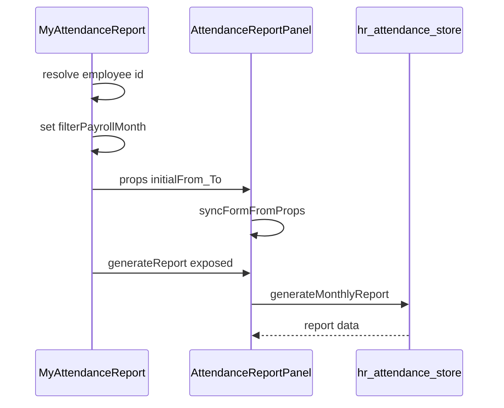

# My attendance: payroll month + auto-report (self-service only)

## Scope

- **In scope:** [`src/views/hr/MyAttendanceReport.vue`](src/views/hr/MyAttendanceReport.vue) and [`src/components/hr-dashboard/attendance/AttendanceReportPanel.vue`](src/components/hr-dashboard/attendance/AttendanceReportPanel.vue) only.
- **Out of scope:** [`src/views/hr/Attendance.vue`](src/views/hr/Attendance.vue), [`src/components/hr-dashboard/AttendanceReportDrawer.vue`](src/components/hr-dashboard/AttendanceReportDrawer.vue), and [`src/stores/hr/attendance.js`](src/stores/hr/attendance.js) (already posts to `payroll-system/attendance-monthly` via `generateMonthlyReport`).

## 1. Strip headers on My attendance

In [`MyAttendanceReport.vue`](src/views/hr/MyAttendanceReport.vue):

- Remove the outer page title block (**"My attendance"** / subtitle, ~lines 3–6).
- Remove the purple gradient **"Monthly Attendance Report"** header above the panel (~lines 16–21).
- Keep the **not-linked** amber alert when `!effectiveEmployeeId` (unchanged behavior).
- Use a single light container (e.g. existing white card / border) so the first visible UI matches the mockup: period control then report content.

## 2. Payroll month + period line (parent-owned)

In [`MyAttendanceReport.vue`](src/views/hr/MyAttendanceReport.vue):

- Import **`getPayrollDates`** and **`defaultPayrollMonthRange`** from [`src/utils/payrollPeriod.js`](src/utils/payrollPeriod.js) (already used partially today).
- Add `filterPayrollMonth` ref initialized from **`defaultPayrollMonthRange().payrollMonth`**.
- Add a computed **`periodBounds`** = `getPayrollDates(filterPayrollMonth)` for `from_date` / `to_date`.
- Template: **Payroll Month** label, `input type="month"` (same Tailwind patterns as [`Attendance.vue`](src/views/hr/Attendance.vue) payroll block), optional `LucideCalendar`, and subtext **Period: `from` — `to`** (same copy style as Payrolls/Attendance).

Pass into the panel:

```vue
:initial-from="periodBounds.from_date" :initial-to="periodBounds.to_date"
```

The panel already watches `initialFrom` / `initialTo` and runs **`syncFormFromProps`** ([`AttendanceReportPanel.vue`](src/components/hr-dashboard/attendance/AttendanceReportPanel.vue) ~394–400), so `reportForm` stays aligned with the selected month.

## 3. Hide built-in From/To + Generate for this route

In [`AttendanceReportPanel.vue`](src/components/hr-dashboard/attendance/AttendanceReportPanel.vue):

- Add a boolean prop, e.g. **`hideControls`** (default `false`).
- When `hideControls` is true, **do not render** the filter grid (employee / from / to) nor the **Generate Report** button block (~lines 3–54).
- Drawer + admin usage: keep **`hideControls` false** (no prop passed).

## 4. Auto-generate monthly report

The API call remains **`handleReport`** → `store.generateMonthlyReport` (same payload: `employee_id`, `from_date`, `to_date`).

In [`AttendanceReportPanel.vue`](src/components/hr-dashboard/attendance/AttendanceReportPanel.vue):

- **`defineExpose`**: add **`generateReport: handleReport`** (and keep existing **`reset`**). Optionally add **`suppressSuccessToast`** prop if repeated auto-loads should not spam `notyf.success` (product choice; default can stay as today).

In [`MyAttendanceReport.vue`](src/views/hr/MyAttendanceReport.vue):

- After **`resolvePayrollEmployeeFromDirectory()`** completes and whenever **`filterPayrollMonth`** or **`effectiveEmployeeId`** changes, call **`await nextTick()`** then **`panelRef.value?.generateReport()`** if `effectiveEmployeeId` is set.
- Use a **`watch`** with `[filterPayrollMonth, effectiveEmployeeId]` (and guard on empty employee id).
- **Initial load:** same trigger after mount resolution so the first month loads without a manual button.



## 5. Verification

- Log in as a normal employee: `/hr/my-attendance` shows **no** duplicate headers; **Payroll Month** + period line; report table fills **without** clicking Generate; changing month refetches for the **same logged-in employee id**.
- Log in as admin on full Attendance: **Monthly Report** drawer unchanged (panel still shows employee + dates + button).
