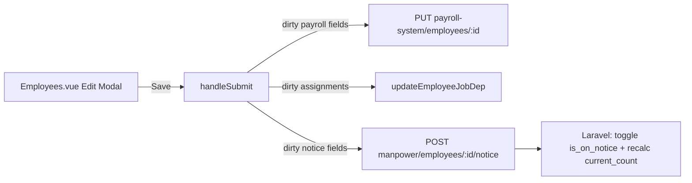

# Technical Plan: Employee Notice Period Flag

**Task ID:** employee-notice-period  
**Status:** Ready for Implementation  
**Based on:** spec.md  
**Created:** 2026-09-12

## 1. System Architecture

Frontend-only integration with an existing Laravel manpower endpoint. Edit Employee Save remains the orchestration point: payroll update and assignment updates stay as today; notice is a separate POST when notice fields are dirty.



| Decision | Choice | Rationale |
|----------|--------|-----------|
| Where UI lives | Edit Employee → Basic Info → Employment Details | Stakeholder-selected location |
| Persist timing | With Save button | Stakeholder choice; avoids partial toggles |
| API surface | Dedicated notice POST, not employee PUT | Matches backend contract; avoids coupling payroll payload |
| New Employee | Hide notice controls | Endpoint requires employee id |
| Directory badge | Deferred (Nice to Have) | Undecided; keep MVP focused |
| Save order | Payroll/assignments first, then notice if dirty | Matches existing change detection; if notice fails after payroll success, show error and keep modal open with refreshed originals where practical |

## 2. Technology Stack

| Layer | Technology | Rationale |
|-------|------------|-----------|
| UI | Vue 3 SFC (`Employees.vue`) | Existing Employees Directory modal |
| State | Pinia `useHrEmployeesStore` | Same pattern as `terminateEmployee` |
| HTTP | `apiClient` + `Api.js` constants | Sanctum auth already wired |
| Backend | Existing `POST /api/manpower/employees/{id}/notice` | No backend work in this task |

**Dependencies:** none new.

## 3. Component Design

### 3.1 `src/api/Api.js`

- **Purpose:** Expose notice endpoint helper.
- **Interface:** `MANPOWER_EMPLOYEE_NOTICE = (id) => \`manpower/employees/${id}/notice\``
- **Dependencies:** none.

### 3.2 `src/stores/hr/employees.js`

- **Purpose:** Call notice API; toast + `handleError` like other mutations.
- **Interface:** `setEmployeeNotice(id, { is_on_notice, notice_period_ends_at? })`
- **Behavior:** POST body; on success optional list refresh (caller may already refresh); rethrow after `handleError`.
- **Dependencies:** `apiClient`, `MANPOWER_EMPLOYEE_NOTICE`, `notyf`, `handleError`.

### 3.3 `src/views/hr/Employees.vue`

- **Purpose:** Notice checkbox + conditional end-date; load/save integration.
- **Responsibilities:**
  - Form fields: `is_on_notice`, `notice_period_ends_at`
  - Show controls only when `isEditing`
  - Disable/hide when employee status is terminated
  - Show date input only when `is_on_notice === true`
  - Seed from employee row on `openEditModal`
  - In `handleSubmit` (edit path): detect notice dirty vs `originalForm`; call `setEmployeeNotice`; fix “No changes made” when only notice changed
- **Dependencies:** employees store, existing modal/form patterns.

## 4. Data Model

```ts
// Form / originalForm extensions
interface EmployeeNoticeFormFields {
  is_on_notice: boolean;
  notice_period_ends_at: string | null; // YYYY-MM-DD
}

// POST body
interface EmployeeNoticePayload {
  is_on_notice: boolean;
  notice_period_ends_at?: string | null;
}
```

**Load mapping:** Prefer `emp.is_on_notice` / `emp.notice_period_ends_at`; fall back to nested fields if API nests them. Default `false` / `null` if absent.

**Submit mapping:**
- If `is_on_notice === true`: send `{ is_on_notice: true, notice_period_ends_at: date or omit }`
- If `false`: send `{ is_on_notice: false }` (omit/clear date)

## 5. API Contracts

| Method | Path | Description |
|--------|------|-------------|
| POST | `/api/manpower/employees/{id}/notice` | Toggle notice; recalc manpower headcount |

**Request:**
```json
{
  "is_on_notice": true,
  "notice_period_ends_at": "2026-09-30"
}
```

**Success 200:**
```json
{
  "message": "Employee notice status updated and headcount recalculated.",
  "data": {
    "employee_id": 123,
    "is_on_notice": true,
    "notice_period_ends_at": "2026-09-30"
  }
}
```

**Errors:** 401 unauthenticated; 404 employee not found; 422 validation (terminated, date not after today).

## 6. Security Considerations

- [x] Reuse Sanctum session via `apiClient`
- [x] Gate UI behind existing `UPDATE_EMPLOYEE` (edit modal already gated)
- [x] Do not expose notice on create
- [x] Block UI for terminated employees to reduce 422 noise

## 7. Performance Strategy

- One extra POST only when notice fields dirty
- No polling; rely on existing `getEmployees()` refresh after mutations
- No Manpower Overview refetch required in this task (backend already recalculates)

## 8. Implementation Phases

- [ ] **Phase 1 — API + store:** Constant + `setEmployeeNotice`
- [ ] **Phase 2 — Form UI:** Checkbox + conditional date in Employment Details (edit only)
- [ ] **Phase 3 — Load/save wiring:** Seed on edit; dirty-check + call on Save; fix no-changes path
- [ ] **Phase 4 — Edge cases + QA:** Terminated disable; error toasts; manual manpower/job-req check

## 9. Risk Assessment

| Risk | Impact | Likelihood | Mitigation |
|------|--------|------------|------------|
| List API omits notice fields | Cannot show current state | Medium | Default false; after save refresh; document backend include if needed |
| Partial success (payroll OK, notice fails) | Inconsistent UX | Medium | Keep modal open; show notice error; user can retry notice |
| Date required by API but optional in UI | 422 on save | Medium | Client-side require date when checked if QA confirms API requires it |
| Confusion with candidate `notice_period` | Wrong field reuse | Low | Use `is_on_notice` / `notice_period_ends_at` only |

## 10. Open Questions

- [ ] Directory badge/column — deferred unless requested
- [ ] Confirm list/GET includes notice fields
- [ ] Confirm whether `notice_period_ends_at` is required when `is_on_notice` is true

## Next Steps

1. Review this plan
2. Run `/tasks employee-notice-period` for task breakdown
3. Run `/implement employee-notice-period` to build

*Plan created with SDD 6.0*
