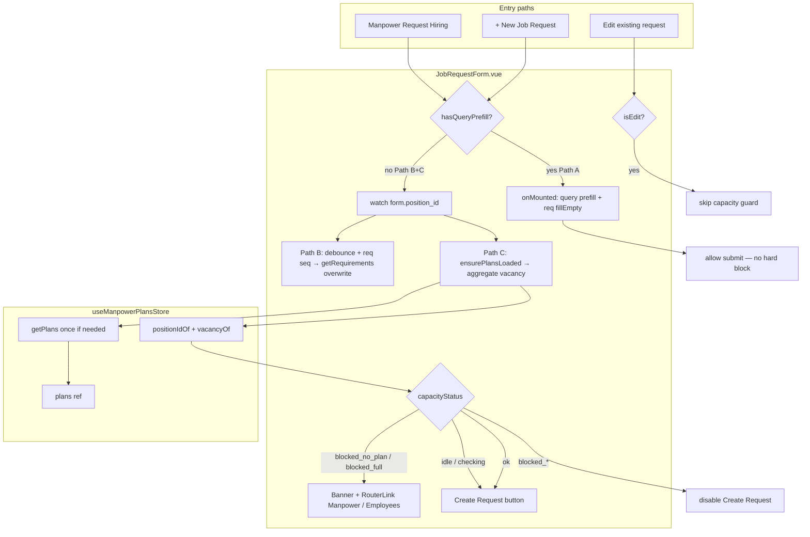

# Technical Plan: job-request-prefill

**Task ID:** job-request-prefill  
**Brief:** `feature-brief.md` v1.4  
**Created:** 2026-09-14  
**Updated:** 2026-09-14  
**Status:** Completed

---

## Overview

HR Job Request creation has three concerns in one form (`JobRequestForm.vue`):

1. **Path A (shipped)** — Manpower Overview **Request Hiring** navigates with query params; position locked; requirements applied with `fillEmpty`.
2. **Path B (shipped)** — Manual **+ New Job Request**; watching `position_id` fetches requirements and **overwrites** mapped fields (debounce + request seq); department from selected position.
3. **Path C (new — v1.1)** — On **manual create only**, after Position is selected, resolve aggregate manpower **vacancy** for that `position_id` via `useManpowerPlansStore`. If there are **no plans** for the position, or plans exist but **Σ vacancy ≤ 0**, **block Create Request**, show a simple banner with router links to Manpower Overview and Employees.

**Capacity guard does not apply to:** edit mode, or (by default) the Manpower query-prefill path (CTA already requires vacancy > 0). Optional soft check on Path A is allowed but not required. Capping `requested_count` to remaining vacancy is an **optional** polish phase.

**No new backend endpoint** — reuse `getPlans()` / in-memory `plans` and helpers `positionIdOf` / `vacancyOf`.

---

## Decisions (locked)

| # | Decision | Choice | Rationale |
|---|----------|--------|-----------|
| D1 | Where guard runs | **Manual create only** (`!isEdit && !hasQueryPrefill`) | Product: protect targets when HR skips Manpower; Manpower CTA already gates on vacancy > 0 |
| D2 | Vacancy source | Aggregate all plans where `positionIdOf(plan) === position_id` using store helpers | Matches ManpowerOverview parent-row aggregation pattern; multi-branch plans must sum |
| D3 | No plans for position | **BLOCK** | Must create/edit plan on Manpower Overview first |
| D4 | Plans exist && Σ vacancy ≤ 0 | **BLOCK** | Position filled vs ideal; free seats via plan increase or departure |
| D5 | UX when blocked | Simple banner + links: `hr-manpower-overview`, `hr-employees` | Actionable next steps without changing Manpower CTA |
| D6 | Submit | Disable **Create Request** when blocked (and while capacity is still loading) | Prevent bypass |
| D7 | Manpower Request Hiring | **Do not break**; Path A unchanged | Prefill + fillEmpty requirements remain |
| D8 | Edit mode | **Skip** capacity guard | Create-only; drafts mid-edit not blocked |
| D9 | Path A (query prefill) | **Allow** submit; optional soft check OK, not required | Vacancy already > 0 at CTA |
| D10 | Cap `requested_count` | **Optional phase** — not must | Nice-to-have after core block works |
| D11 | Plans load strategy | Load once / reuse Pinia `plans`; call `getPlans()` only if empty / never loaded | Avoid refetch on every keystroke or every debounce tick |
| D12 | Primary surface | `JobRequestForm.vue` only for Path C | No ManpowerOverview CTA change |

---

## Architecture



```
Path A (SHIPPED — preserve):
  ManpowerOverview (vacancy > 0 CTA)
    → query(position_id, position_name, department_id, branch_id, count, request_type, …)
    → JobRequestForm mount
         ├─ position locked; fillEmpty requirements
         ├─ fieldLoading on prefill targets only
         └─ capacity guard: SKIP (hard block off); soft check optional

Path B (SHIPPED — preserve):
  + New Job Request → user selects Position
         ├─ skip if isEdit OR hasQueryPrefill
         ├─ debounce 200ms + requirementsReqSeq
         ├─ getRequirements → overwrite mapped fields + department
         └─ no req → leave employment/budget/notes; dept from position OK

Path C (NEW):
  Same manual create watch (or shared ensure after position settles)
         ├─ skip if isEdit OR hasQueryPrefill
         ├─ ensure plans loaded once (getPlans if plans.length === 0 / not yet fetched)
         ├─ filter plans by positionIdOf === form.position_id
         ├─ if none → blocked_no_plan
         ├─ else sum(vacancyOf) ≤ 0 → blocked_full
         ├─ else → ok (optionally expose remainingVacancy)
         ├─ banner + links; disable Create Request when blocked
         └─ do not refetch plans on every keystroke
```

---

## Technology Stack

| Layer | Choice | Rationale |
|-------|--------|-----------|
| Frontend | Vue 3 Composition API (`watch`, `computed`, `reactive`) | Form already script-setup; Path B watch is natural hook for Path C |
| State | Existing Pinia `useManpowerPlansStore` | `getPlans`, `plans`, `positionIdOf`, `vacancyOf` — no new API |
| Requirements (shipped) | `useHrPositionRequirementsStore.getRequirements` | Unchanged |
| Routing | Vue Router names `hr-manpower-overview`, `hr-employees` | Stable named routes in `hr-dashboard.js` |
| Backend | Unchanged `GET manpower/manpower-plans` | Client aggregates; no new endpoint |
| DB / Deploy | N/A | Client-only for Path C |

---

## Components

| Name | Responsibility | Dependencies | Notes |
|------|----------------|--------------|-------|
| **JobRequestForm.vue** | Primary: Path A/B (shipped) + Path C capacity state, banner UI, submit disable | `useManpowerPlansStore`, requirements/positions stores, `vue-router` | Single-file focus |
| **useManpowerPlansStore** | Provide plans list + helpers; optional tiny `ensureLoaded` if added | `MANPOWER_PLANS` API | Prefer form-local ensure; store change optional |
| **ManpowerOverview.vue** | Unchanged CTA / query shape | — | Regression only |
| **Router** | Named routes for banner links | `hr-dashboard.js` | No route changes expected |

### Internal helpers (JobRequestForm — Path C)

| Helper / state | Role |
|----------------|------|
| `ensureManpowerPlansLoaded()` | If store has no plans yet (or never fetched this session), `await getPlans()` once; reuse thereafter |
| `plansForPosition(positionId)` | `plans.filter(p => String(positionIdOf(p)) === String(positionId))` |
| `aggregateVacancy(positionId)` | `sum(vacancyOf(p))` over `plansForPosition` |
| `capacityStatus` | `'idle' \| 'checking' \| 'ok' \| 'blocked_no_plan' \| 'blocked_full' \| 'error'` |
| `remainingVacancy` | Number when `ok` (and optional phase for count cap) |
| `capacityBlocked` | computed: status is `blocked_no_plan` or `blocked_full` |
| `canSubmitCreate` | `!store.submitting && !prefillBusy && !capacityBlocked && capacityStatus !== 'checking'` (create mode) |

### Shipped helpers (preserve)

| Helper | Role |
|--------|------|
| `applyRequirementsToForm(req, { mode })` | `fillEmpty` (Path A) / `overwrite` (Path B) |
| `fetchAndApplyRequirementsForPosition` | Debounced Path B fetch + seq |
| `resolvePositionDepartmentId` | Department from positions list |
| `hasQueryPrefill` / `isEdit` | Path guards |

---

## API Design

### GET `manpower/manpower-plans` (existing — Path C)

| | |
|--|--|
| **Req** | Optional query params via existing `getPlans(params)` — default **no filter** (load all plans once) |
| **Res** | `{ data: Plan[] }` where each plan has nested `position: { id, name }`, `ideal_count`, `current_count`, `vacancy` |
| **Client use** | Filter by `positionIdOf`; sum `vacancyOf` |
| **Errors** | Catch at form; set `capacityStatus = 'error'`; prefer **fail closed** for manual create (block submit + message to retry / open Manpower) OR soft-retry once — **recommend fail closed** so targets are not bypassed on API failure |

### GET `manpower/position-requirements?position_id=` (existing — Paths A/B)

Unchanged. Empty list → do not overwrite employment/budget/notes on Path B.

### Job request create/update

No payload changes required for Path C. Optional later: server-side vacancy validation (out of scope).

---

## Data Models

### Capacity state (Path C)

```json
{
  "capacity": {
    "status": "idle | checking | ok | blocked_no_plan | blocked_full | error",
    "positionId": "string | null",
    "planCount": 0,
    "remainingVacancy": 0,
    "message": {
      "blocked_no_plan": "No manpower plan for this position. Create or edit a plan on Manpower Overview before requesting hire.",
      "blocked_full": "This position has no open vacancy (filled vs planned headcount). Increase ideal count on Manpower Overview, or process a departure/notice on Employees to free a seat.",
      "error": "Could not verify manpower vacancy. Try again or open Manpower Overview."
    },
    "links": [
      { "name": "hr-manpower-overview", "label": "Manpower Overview" },
      { "name": "hr-employees", "label": "Employees", "when": "blocked_full (also OK on no_plan as secondary)" }
    ]
  },
  "guards": {
    "capacityGuardEnabled": "!isEdit && !hasQueryPrefill",
    "manualRequirementsPrefill": "!isEdit && !hasQueryPrefill",
    "positionLocked": "hasQueryPrefill && !isEdit"
  },
  "aggregation": {
    "match": "String(positionIdOf(plan)) === String(form.position_id)",
    "vacancy": "sum(vacancyOf(plan)) — prefer plan.vacancy, else max(0, ideal - current)",
    "blockIf": "planCount === 0 OR remainingVacancy <= 0"
  },
  "loadPolicy": {
    "getPlans": "once per form session if plans empty / not loaded; reuse store.plans",
    "doNot": "refetch on every keystroke, every character in other fields, or every debounce without position change"
  }
}
```

### Prefill field model (shipped — Paths A/B)

```json
{
  "manualOverwriteFields": {
    "fromRequirements": [
      "employment_type <- job_type (if in EMPLOYMENT_TYPES)",
      "budget_salary_from <- salary_min",
      "budget_salary_to <- salary_max",
      "notes <- buildRequirementNotes(req) when non-empty"
    ],
    "fromPosition": [
      "department_id <- position.department_id || position.department.id"
    ]
  },
  "untouchedByRequirements": [
    "requested_by_employee_id",
    "replacement_for_employee_id",
    "priority",
    "needed_before",
    "reason",
    "requested_count",
    "request_type",
    "branch_id"
  ],
  "applyModes": {
    "fillEmpty": "Path A mount",
    "overwrite": "Path B position change"
  },
  "race": {
    "debounceMs": 200,
    "requestSeq": "requirementsReqSeq; apply only if current"
  }
}
```

---

## Security Considerations

- Capacity check and prefill remain behind existing `create-job-requests` / form access — no new permissions.
- Manpower plans endpoint is already used by HR Manpower screens; form reuses the same authenticated client.
- Banner links navigate to existing HR routes; do not expose extra IDs in the URL beyond normal navigation.
- Edit mode must never auto-block or overwrite via capacity/requirements watches.
- Client-side guard is UX enforcement; true enforcement remains organizational process (optional future server check — out of scope).
- Do not log PII from notes/requirements beyond existing UI.

---

## Performance Targets

| Metric | Target |
|--------|--------|
| Plans network calls | **≤ 1** `getPlans()` per form open when store empty; **0** when `plans` already populated |
| Requirements (Path B) | One settled request per position selection (200ms debounce + seq) |
| Stale response apply | Zero for requirements; capacity recompute is sync over in-memory plans after load |
| UI blocking | Prefill: only employment / budget / notes / department (etc.); Capacity: banner + disable submit — do not freeze entire form |
| Keystrokes | Changing reason/notes/count must **not** trigger `getPlans` |
| Path A | No capacity hard-block; no extra watch overwrite after mount |

---

## Implementation Phases

### Phase 0 — Spec sync (Setup) — ~0.5h — [ ]

- Align `todo-list.md` / `specs/index.md` with brief v1.1 capacity guard.
- Keep shipped Path A/B items marked done; add Path C todos.

**sdd.touchedFiles:** `["specs/active/job-request-prefill/todo-list.md", "specs/index.md"]`

### Phase 1 — Capacity resolve helpers (Core) — ~1–2h — [ ]

- Import `useManpowerPlansStore`.
- Implement `ensureManpowerPlansLoaded`, `plansForPosition`, `aggregateVacancy`.
- Reactive `capacityStatus` / `remainingVacancy` / `capacityBlocked`.
- Trigger after manual position settles (same watch as Path B or chained after debounce) when `capacityGuardEnabled`.
- Reset to `idle` when position cleared.
- Skip entirely when `isEdit` or `hasQueryPrefill`.

**sdd.touchedFiles:** `["src/views/recruitment/JobRequestForm.vue"]`

### Phase 2 — Banner + submit gate (Core) — ~1–2h — [ ]

- Simple alert/banner above form (or under Position) when `blocked_no_plan` or `blocked_full`.
- Copy per locked messages; include `RouterLink` / `router.push` to:
  - `{ name: 'hr-manpower-overview' }`
  - `{ name: 'hr-employees' }` (emphasize on `blocked_full`)
- Disable Create Request when `capacityBlocked` or `capacityStatus === 'checking'` (create mode).
- Keep `prefillBusy` behavior; combine disables without fighting each other.
- On `error`: fail closed (block + retry/link) per API design.

**sdd.touchedFiles:** `["src/views/recruitment/JobRequestForm.vue"]`

### Phase 3 — Regression / Path A–B integrity (Integration) — ~1–2h — [ ]

- Manpower Request Hiring: still prefills; position locked; Create allowed when vacancy > 0 at CTA.
- Manual create with vacancy > 0: banner hidden; submit enabled (after check).
- Manual create no plan / full: blocked as specified.
- Edit mode: no banner/block from capacity.
- Path B requirements overwrite still works; no plans refetch storm.

**sdd.touchedFiles:** `["src/views/recruitment/JobRequestForm.vue"]` (fixes only if needed)

### Phase 4 — Polish & verify (Polish) — ~1h — [ ]

- Loading indicator for capacity check (subtle; optional spinner near Position).
- Update todo-list checkboxes; run sdd-verifier against brief v1.1 acceptance.
- Confirm no ManpowerOverview CTA changes.

**sdd.touchedFiles:** `["src/views/recruitment/JobRequestForm.vue", "specs/active/job-request-prefill/todo-list.md"]`

### Phase 5 — Optional: cap `requested_count` (Nice-to-have) — ~1–2h — [ ]

- When `capacityStatus === 'ok'` and `remainingVacancy >= 1`, clamp max on count input / validate `requested_count <= remainingVacancy`.
- Do **not** block this phase on core delivery.
- Skip on Path A unless product asks (query may already pass count).

**sdd.touchedFiles:** `["src/views/recruitment/JobRequestForm.vue"]`

### DAG / parallelism

```json
{
  "dag": {
    "roots": ["phase-0"],
    "parallelGroups": [
      ["phase-0"],
      ["phase-1"],
      ["phase-2"],
      ["phase-3"],
      ["phase-4"],
      ["phase-5"]
    ]
  },
  "note": "Phases 1–5 share JobRequestForm.vue — run sequentially. Do not parallelize implementers on the same file."
}
```

**Effort (must):** ~4.5–7.5h for Phases 0–4.  
**Optional Phase 5:** +1–2h.  
**Shipped work:** Paths A/B complete — do not re-implement; only regression-guard.

---

## Risks

| Risk | Probability | Impact | Mitigation |
|------|-------------|--------|------------|
| Store `plans` empty because another screen never loaded them | Med | High — false `blocked_no_plan` | `ensureManpowerPlansLoaded` always calls `getPlans` when not yet loaded this session (track `plansLoadedOnce` flag if empty list is valid) |
| Empty `plans: []` after successful fetch vs “not loaded” | Med | High | Distinguish `loaded` boolean (form or store) from `plans.length === 0` |
| Stale plans after user edits Manpower in another tab | Low | Med | Accept session snapshot; optional “Refresh” link; out of scope to poll |
| Path A accidentally hard-blocked | Med | High | Guard `!hasQueryPrefill`; automated/manual regression on Request Hiring |
| `getPlans` error toast + block frustrates user | Med | Med | Fail closed with clear banner; link to Manpower; avoid duplicate toasts if store already toasts |
| Double work: Path B debounce + Path C both calling network | Low | Low | Path C only hits network for plans once; requirements remain separate |
| Multi-branch: summing vacancy vs single branch intent | Med | Med | Locked: aggregate **all** plans for `position_id` (company-level seat) |
| String vs number position id mismatch | Med | High | Always compare via `String(...)` like existing form `toId` |
| Edit mode false positive | Low | High | Hard skip when `isEdit` |

---

## Testing Strategy

### Unit

- N/A required. Optional pure tests later for `aggregateVacancy` / status mapping if extracted.

### Integration (manual)

| # | Scenario | Expected |
|---|----------|----------|
| 1 | Manpower Request Hiring (vacancy > 0) | Prefill works; Create enabled; no capacity hard-block |
| 2 | New form → position with plans and Σ vacancy > 0 | No block banner; Create enabled after check |
| 3 | New form → position with **no** plans | Banner (no plan); link Manpower; Create **disabled** |
| 4 | New form → plans exist, Σ vacancy = 0 | Banner (full); links Manpower + Employees; Create **disabled** |
| 5 | Switch blocked → ok position | Banner clears; Create enabled |
| 6 | Edit existing request | No capacity banner/block |
| 7 | Path B requirements still overwrite on position change | employment/budget/notes/dept behavior unchanged |
| 8 | Rapid position changes | Only last position’s capacity status sticks; no plans refetch storm |
| 9 | Typing in reason/notes | No additional `getPlans` calls |
| 10 | Plans already in store from Manpower visit | No redundant network call (or at most one ensure) |
| 11 | `getPlans` fails | Fail closed: block + error message / links |
| 12 | Optional Phase 5 | Count cannot exceed `remainingVacancy` when enabled |

### E2E

- Manual smoke: Path A hiring + Path C block/allow. No new automated E2E required for this task.

---

## Open Questions (locked)

| # | Question | Locked answer |
|---|----------|---------------|
| 1 | No manpower plan for position? | **BLOCK** — must create/edit plan on Manpower Overview |
| 2 | Plans exist but vacancy filled (Σ ≤ 0)? | **BLOCK** — message + Manpower + Employees links |
| 3 | Apply guard on edit? | **No** — create-only |
| 4 | Apply hard block on Manpower query path? | **No** — allow; soft check optional only |
| 5 | Change Manpower CTA? | **No** — leave Request Hiring as-is |
| 6 | Cap requested_count to vacancy? | **Optional** Phase 5 — not must |
| 7 | New backend vacancy endpoint? | **No** — reuse `getPlans` + client aggregate |
| 8 | Vacancy scope | **Sum all plans** for that `position_id` |
| 9 | Plans fetch cadence | **Load once / reuse store** — not per keystroke |
| 10 | API failure policy | **Fail closed** on manual create |

---

## Assumptions

1. `getPlans()` without params returns all plans needed to aggregate by position (same as Manpower Overview).
2. `vacancyOf` / backend `vacancy` remain the source of truth for open seats.
3. Named routes `hr-manpower-overview` and `hr-employees` remain stable.
4. Empty successful plans list means “no plans in system,” not “not loaded” — form must track load completion.
5. Path A query presence (`route.query.position_id`) remains the lock / skip-capacity signal.

---

## Out of Scope

- Changing Manpower Overview CTA or query shape
- Server-side vacancy validation on job-request create
- AbortController through Pinia/axios for requirements
- Soft-clear of auto-notes when switching to no-requirements position
- Prefilling Branch / Request Type / Count from requirements
- Automatic refresh of plans on window focus
- Unit test harness introduction
- Phase 5 count capping (tracked as optional only)

---

## Shipped baseline (do not regress)

| Item | Status |
|------|--------|
| Prefill Position (+ related query fields) from Manpower | Done |
| Per-field loading only on prefill targets | Done |
| Requirements by `position_id`; fillEmpty on Path A | Done |
| Manual Position watch; overwrite + dept; debounce + seq | Done |
| Unmatched requirement hints → Notes | Done |
| Manpower `deptId` / query wiring | Done |

---

Status: Ready | Lead: Auto | 2026-09-14
