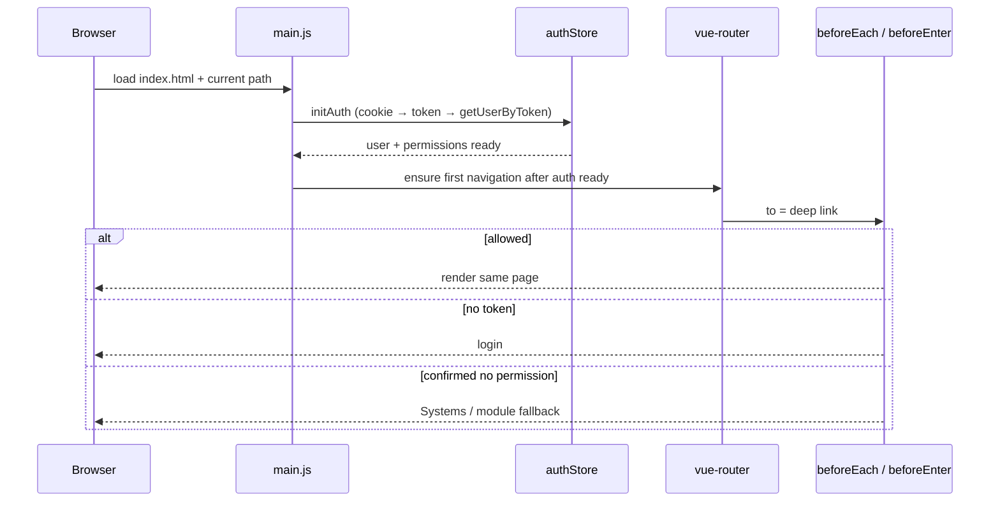

# Technical Plan: Persist Current Page on Refresh

**Task ID:** route-persist-on-refresh  
**Created:** 2026-09-13  
**Status:** Completed  
**Completed:** 2026-09-13  
**Version:** 1.0

## Overview

Fix SPA refresh so authenticated users remain on the current deep link. Root cause class: **navigation guards redirect to `SystemsPage` (or similar) when session/permissions are not ready or when bootstrap order races with the first navigation**. The URL in History mode is already the source of truth—no “last route” persistence layer is required for the primary fix.

## Architecture



## Components

| Component | Responsibility | Dependencies |
|-----------|----------------|--------------|
| `src/main.js` | Bootstrap order: Pinia → initAuth → router ready/mount | `authStore`, router |
| `src/stores/auth.js` | Expose `authReady` / bootstrap flag; keep `initAuth` | Cookies, `USER_BY_TOKEN` |
| `src/router/index.js` | Global guard: wait for auth ready; only then permission redirects | `authStore`, `access-control.js` |
| `src/router/hr-dashboard.js` (and siblings) | Align `beforeEnter` deny paths with “auth ready” rule | `authStore` |
| Optional tiny helper | `ensureAuthReady()` used by guards | `authStore` |

## Technology Stack

| Layer | Choice | Rationale |
|-------|--------|-----------|
| Router | Existing Vue Router `createWebHistory` | Deep links already in the URL |
| State | Existing Pinia `authStore` | Token cookie + `getUserByToken` already exist |
| Persist last route | **Not primary** | Band-aid; fix guards/bootstrap instead |
| New libraries | None | Keep change set small |

## Primary approach (recommended)

1. **Auth readiness gate**  
   - Add something like `authReady` (or reuse completion of `initAuth`) so guards know bootstrap finished.  
   - While not ready: `await initAuth()` / wait on a promise—**do not** redirect to Systems for failed `can()` / `hasPermission()`.

2. **Bootstrap ordering**  
   - Confirm `app.use(router)` does not run the first guarded navigation before `initAuth` completes.  
   - Preferred pattern: create pinia → `initAuth()` → `app.use(router)` → `await router.isReady()` → `mount`, **or** keep current mount-after-initAuth but ensure router installation does not race (verify against current Vue Router behavior and fix if it does).

3. **Guard policy**  
   - Missing permission redirects to Systems only when `authReady && !can(...)`.  
   - Empty permissions + no user after ready + valid token edge cases: follow existing logout/error path, not Systems.

4. **Local `beforeEnter` (HR, etc.)**  
   - Same readiness rule in `nextIfCanAny` / inline guards so module guards cannot false-deny on refresh.

## Alternative approaches (not preferred)

| Option | Pros | Cons | Fit |
|--------|------|------|-----|
| Save `lastRoute` in sessionStorage and redirect after Systems | Simple mentally | Fights the router; flash; ignores real denials | Low |
| Soften all permission checks | Stops redirects | Security risk | Reject |
| Server-only fix | Helps 404 on refresh | Does not explain Systems redirect when SPA loads | Partial only |

## API Design

No new backend endpoints. Continues to use:

- Cookie `token`
- `GET` user-by-token (`USER_BY_TOKEN`) via existing `getUserByToken`

## Data Models

No schema changes. Client-only:

```text
authStore:
  token, user, permissions
  + authReady: boolean (or equivalent promise)
  initAuth(): restores cookie, loads user, sets ready
```

## Security Considerations

- Never skip permission checks after bootstrap.
- Do not grant access while `permissions` are empty unless user is confirmed admin via loaded `user` payload.
- Invalid token → existing `forceLogout` / login.
- Do not store secrets in `localStorage` beyond current cookie strategy.

## Performance Targets

- No extra network calls beyond existing `initAuth` / `getUserByToken`.
- Avoid double `getUserByToken` on startup.
- First paint may wait on auth (already true in `main.js`); keep that wait, make it correct.

## Implementation Phases

### Phase 1: Diagnose & instrument (Setup)
- Confirm race: log guard decisions on refresh (dev-only) for Systems redirects.
- Map all redirect-to-`SystemsPage` call sites.

### Phase 2: Auth readiness + bootstrap (Core)
- Add readiness API on `authStore`.
- Fix `main.js` / router install order as needed.
- Update global `beforeEach` to wait and only then deny.

### Phase 3: Module guards (Integration)
- Update HR (and any other) `beforeEnter` helpers to respect readiness.
- Smoke-test deep links across modules.

### Phase 4: Polish & verify
- Remove debug logs.
- QA checklist per spec success metrics.
- Short note in spec/plan if deny destinations differ by module.

## Risks

| Risk | Probability | Impact | Mitigation |
|------|-------------|--------|------------|
| Router install still races before auth | Medium | High | Defer `app.use(router)` until after `initAuth` |
| Waiting in guards causes deadlock | Low | High | Single shared init promise; never re-enter init without resolve |
| Real permission bugs masked as “fixed” | Medium | Medium | Test limited-permission users still denied |
| Flash of empty layout | Low | Low | Keep mount-after-auth or show existing loading shell |

## Testing Strategy

- **Manual / QA:** Refresh 3× on allowed routes in HR, dashboard, recruitment, finance; confirm URL stable.
- **Security:** Limited user refreshes forbidden route → still Systems/fallback.
- **Session:** Clear cookie / invalidate token → login.
- **Regression:** Login still lands on `/systems`; `/` + auth still → Systems.
- **Unit (optional):** Guard helper: not ready → no Systems redirect; ready + !can → Systems.

## Open Questions

- Confirm whether any environment fails History fallback (server must serve `index.html` for deep links). If refresh shows blank/404, that is deploy config—separate from Systems redirect.
- “Dashboard” vs `SystemsPage`: treat all false post-refresh landings on Systems hub as in-scope.

## Next Steps

1. Generate `tasks.md` / todo-list  
2. `/implement route-persist-on-refresh`

*Plan created with SDD 6.0*
