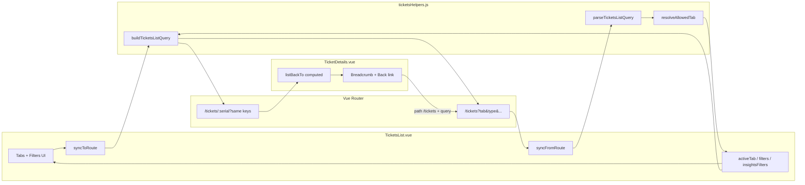

# Technical Plan: Ticket List Tab & Filter Restore

**Task ID:** ticket-tab-restore  
**Status:** Completed  
**Completed:** 2026-09-16  
**Based on:** spec.md (v1.0)  
**Estimate:** ~4–8 hours total

## 1. System Architecture

Persist Tickets list tab + filters in the `/tickets` URL query so remounts (detail → list, refresh, deep link) restore the same view. Detail navigations carry the full list query; breadcrumb / “Back to all tickets” rebuild `/tickets?...`. Forbidden or invalid `tab` values fall back to Open with URL normalize via `router.replace`.



### Architecture decisions

| Decision | Choice | Rationale |
|----------|--------|-----------|
| Persistence | `/tickets` URL query | Remount-safe; survives refresh; shareable |
| Detail handoff | Carry full list query on detail route | Breadcrumb works even if history was replaced |
| History updates | `router.replace` on tab/filter | Avoid Back spam through intermediate states |
| Forbidden tab | Fall back to Open + normalize URL | Spec FR-4; silent |
| Query keys | `tab`, `type`, `category`, `start_date`, `end_date`, `unread_only` | Match existing filter field names |
| Insights filters | Same keys when `tab=insights` | One parser/builder; omit `unread_only` for insights |
| Backend | No API changes | UI persistence only |
| Helpers location | `src/utils/ticketsHelpers.js` | Pure, reusable, testable |

## 2. Technology Stack

| Layer | Technology | Rationale |
|-------|------------|-----------|
| UI | Vue 3 Composition API | Existing `TicketsList` / `TicketDetails` |
| Routing | Vue Router 4 (`useRoute` / `useRouter`) | Query is first-class; no new routes |
| Local state | `ref` / `reactive` | URL is source of truth across navigations |
| Data cache | Existing Pinia `ticketsStore` | Unchanged fetch contracts |
| Auth | `authStore.can(...)` | Same gating as tab buttons |
| Utils | `ticketsHelpers.js` | Pure parse/build/resolve |
| New dependencies | **None** | Client-only feature |

## 3. Component Design

### 3.1 Query helpers — `src/utils/ticketsHelpers.js`

| Function | Purpose |
|----------|---------|
| `parseTicketsListQuery(query)` | Coerce `route.query` → `{ tab, type, category, start_date, end_date, unread_only }` |
| `buildTicketsListQuery(state)` | Build clean router query (omit `tab` when open; omit empties; `unread_only: '1'` only when true and not insights) |
| `resolveAllowedTab(tab, { canTasks, canInsights })` | Unknown / forbidden → `'open'` |
| `ticketsListQueryEquals(a, b)` *(optional)* | Prevent no-op `replace` loops |

**Parse rules:** take first value if array; dates must match `YYYY-MM-DD` or coerce to `''`; `unread_only` true only for `'1'` / `'true'`.

### 3.2 `TicketsList.vue`

| Responsibility | Detail |
|----------------|--------|
| `syncFromRoute()` | Parse → resolve tab → hydrate `activeTab` + `filters` / `insightsFilters` + `is_closed`; normalize URL if needed |
| `syncToRoute()` | Build query from active context → `router.replace` if changed |
| Tab / filter handlers | Existing logic + `syncToRoute()` after state updates |
| Detail navigation | `router.push({ name: 'tickets-details', params: { serial }, query: buildTicketsListQuery(...) })` |
| `onMounted` | Hydrate from route **then** one data load for restored tab (+ meta); avoid double-fetch of active set |

**Insights:** URL uses `type|category|start_date|end_date` when `tab=insights`. Build always from `activeTab === 'insights' ? insightsFilters : filters`.

### 3.3 `TicketDetails.vue`

| Responsibility | Detail |
|----------------|--------|
| `listBackTo` | `computed(() => ({ path: '/tickets', query: buildTicketsListQuery(parseTicketsListQuery(route.query)) }))` |
| Breadcrumb + “Back to all tickets” | `:to="listBackTo"` instead of bare `/tickets` |

### 3.4 Router

`src/router/index.js` — **no structural change** expected (`/tickets`, `/tickets/:serial` already support query).

## 4. Data Model

```ts
interface TicketsListViewState {
  tab: 'open' | 'closed' | 'tasks' | 'insights';
  type: string;
  category: string;
  start_date: string; // '' or YYYY-MM-DD
  end_date: string;
  unread_only: boolean; // ignored when tab === 'insights'
}

interface TicketsListQuery {
  tab?: 'closed' | 'tasks' | 'insights'; // omitted ⇒ open
  type?: string;
  category?: string;
  start_date?: string;
  end_date?: string;
  unread_only?: '1'; // omitted ⇒ false
}
```

**Example URLs**
- Default: `/tickets`
- Closed + filters: `/tickets?tab=closed&type=bug&start_date=2026-09-01&unread_only=1`
- Insights: `/tickets?tab=insights&start_date=2026-09-01&end_date=2026-09-16`
- Detail: `/tickets/ABC123?tab=closed&type=bug&unread_only=1`

## 5. API Contracts

**N/A — no backend contract changes.**

Existing client calls remain (`store.fetchTickets`, insights `apiClient.get('tickets', ...)`, `fetchMetaOptions`). URL query is UI persistence only and must not invent new API fields.

## 6. Security Considerations

- [ ] Tab gating via `resolveAllowedTab` + same permissions as UI (`view-task-tickets`, `view-others-tickets`)
- [ ] Query cannot bypass API auth; data still loaded through authenticated client
- [ ] Treat all query values as untrusted strings; coerce dates; no HTML injection from query
- [ ] Silent fallback for forbidden tabs (no toast) per spec
- [ ] Filter prefs may appear in shared detail URLs — acceptable for internal staff tool

## 7. Performance Strategy

| Target | Approach |
|--------|----------|
| ≤1 fetch on restore vs normal tab open | Hydrate before first fetch; skip second fetch after normalize |
| No history spam | `replace` for tab/filter updates |
| No replace loops | Equality check + `_isSyncingFromRoute` flag |
| Pinia cache | Keep existing `lastOpenFilters` / `lastClosedFilters` short-circuit where valid |
| Insights | Fetch insights only when that tab is active (preserve dual open/closed prefetch for counts if product needs it, without double-fetching the active filtered set) |

## 8. Implementation Phases

### Phase A — Setup (~0.5–1h)
- [ ] Add `parseTicketsListQuery`, `buildTicketsListQuery`, `resolveAllowedTab` (+ optional equality helper) to `ticketsHelpers.js`
- [ ] Document query key contract in a short comment block
- [ ] Quick helper checks: open omit, `unread_only=1`, forbidden tab resolve

### Phase B — Core (~2–3.5h)
- [ ] `TicketsList.vue`: `syncFromRoute` / `syncToRoute`
- [ ] Wire `setActiveTab`, filter change, clear, unread toggle → `syncToRoute`
- [ ] `onMounted`: hydrate-then-fetch once for restored tab
- [ ] Forbidden/invalid tab normalize with `router.replace`
- [ ] Detail navigation includes built list query

### Phase C — Integration (~1–1.5h)
- [ ] `TicketDetails.vue`: `listBackTo`; update breadcrumb + back link
- [ ] Verify browser Back, Insights round-trip, permission deep-link normalize

### Phase D — Polish (~0.5–1h)
- [ ] Guard replace/watch loops; strip unknown keys on normalize
- [ ] Manual QA checklist (tab + filters + refresh + restricted user)
- [ ] Leave New Ticket success as-is (out of scope)

**Execution order:** helpers → `TicketsList.vue` → `TicketDetails.vue`  
**Touched files:**
- `src/utils/ticketsHelpers.js`
- `src/views/dashboard/tickets/TicketsList.vue`
- `src/views/dashboard/tickets/TicketDetails.vue`

## 9. Risk Assessment

| Risk | Impact | Likelihood | Mitigation |
|------|--------|------------|------------|
| Double fetch on mount | Perf / flicker | Med | Hydrate-then-fetch; avoid legacy parallel refetch of active set |
| `replace` ↔ `watch` loop | UI freeze | Med | Equality check + syncing flag |
| Wrong filter bag written to URL | Incorrect restore | Med | Always build from active tab’s filter object |
| `unread_only` on insights URLs | Noise | Low | Omit in builder when tab is insights |
| Detail opened with no query | Back → defaults | Low | Expected; OK |
| Array query values from Router | Parse crash | Low | Coerce `Array.isArray ? v[0] : v` |
| Tab counts wrong without prefetch | UX | Med | Keep open+closed count prefetch without double-fetching filtered active list |

## 10. Open Questions

| Spec question | Resolution |
|---------------|------------|
| Exact query key names? | **`tab`** (omit when open), **`type`**, **`category`**, **`start_date`**, **`end_date`**, **`unread_only=1`** when true |
| Detail carries query vs history-only? | **Detail carries full list query**; back links rebuild `/tickets?...` |

No remaining blocking questions.

## Testing Strategy

**Helpers:** parse defaults; build omits open/empties; resolve forbidden/unknown; malformed dates → `''`.

**Manual QA:**
- [ ] Closed + filters → detail → breadcrumb → same Closed + filters
- [ ] Tasks / Insights (permitted) round-trip
- [ ] Browser Back restores `/tickets?tab=...`
- [ ] Refresh on queried list URL
- [ ] `?tab=tasks` without permission → Open + URL cleaned
- [ ] `?tab=nope` → Open
- [ ] Default `/tickets` stays clean
- [ ] Network: restore ≤1 extra fetch vs normal tab open

## Next Steps

1. Review this plan
2. Run `/tasks ticket-tab-restore` to generate implementation tasks
3. Run `/implement ticket-tab-restore` to start building

*Plan created with SDD 6.0*
